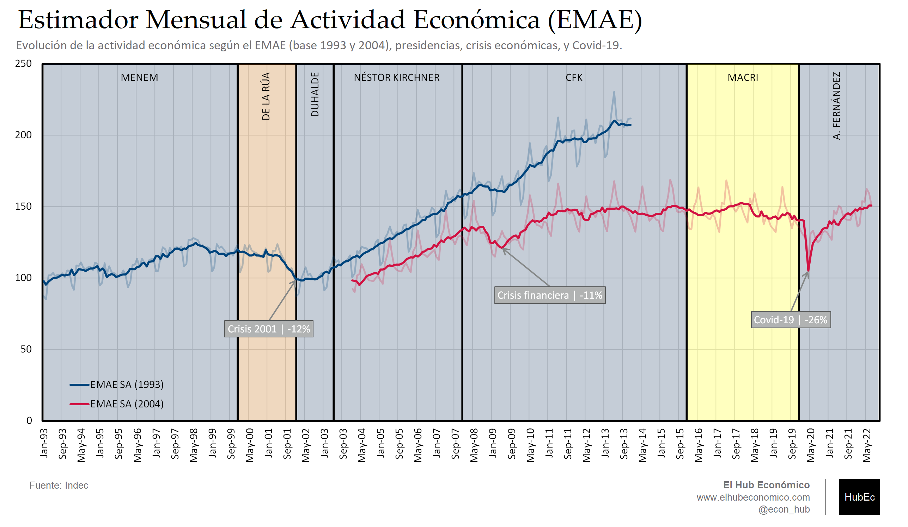

---
# Title, summary, and page position.
linktitle: "Actividad económica"
weight: 2

# Page metadata.
title: Actividad económica
date: "2018-09-09T00:00:00Z"
type: book  # Do not modify.
---

---

## Gráfico 1. Estimador Mensual de Actividad Económica (EMAE)

 [Download](01.01_EMAE.png)

---

## Gráfico 2. PBI real (1994 - 2019)

 [Download](01.02_PBI_real.png)

---

## Gráfico 3. Formación bruta de capital fijo (%PBI): Argentina

 [Download](01.03_Capital_Fijo.png)

---

## Gráfico 4. Formación bruta de capital fijo (%PBI): Países selectos

 [Download](01.04_Capital_Fijo_Paises.png)

---

## Gráfico 5. Productividad total de los factores de producción en moneda local, Argentina (2017 = 1)

 [Download](01.05_TFP.png)

---

## Gráfico 6. Productividad en países selectos (USA = 1)

 [Download](01.06_TFP_Paises.png)