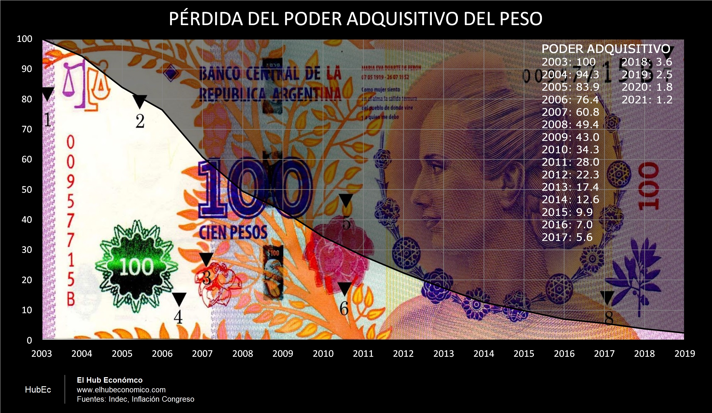

---
# Title, summary, and page position.
linktitle: "Agregados monetarios y precios"
weight: 2

# Page metadata.
title: Agregados monetarios y precios
type: book  # Do not modify.
---

---

## Gráfico 1. Agregados monetarios: Variación interanual



> * FUENTES:
>   * [Banco Central de la República Argentina: Balance Semanal](http://www.bcra.gob.ar/PublicacionesEstadisticas/balances_semanales.asp)
>   * [Banco Central de la República Argentina: Informe Monetario Diario (series históricas)](http://www.bcra.gob.ar/PublicacionesEstadisticas/Informe_monetario_diario.asp)
>   * [Ministerio de Economía | Portal de Datos Económicos: Dinero y Bancos](https://www.economia.gob.ar/datos/)

---

## Gráfico 2. Inflación interanual



> * FUENTES:
>   * [Instituto Nacional de Estadísticas y Censos (INDEC)](https://www.indec.gob.ar/indec/web/Nivel4-Tema-3-9-47)
>   * IPC Congreso: Recolección manual por parte del autor

---

## Gráfico 3. Tiempo en que se duplica el nivel de precios



> * FUENTE:
>   * [Instituto Nacional de Estadísticas y Censos (INDEC)](https://www.indec.gob.ar/indec/web/Nivel4-Tema-3-9-47)
>   * IPC Congreso: Recolección manual por parte del autor
>   * Cálculos del autor
> ---
> **Nota metodológica**: La serie IPC fue corregida con datos de la "Inflación Congreso" para el período enero 2007 - diciembre 2015. La serie estima el tiempo que tarda en duplicarse el nivel de precios con la tasa de inflación interanual de cada período.

---

## Gráfico 4. Agregados monetarios e IPC



> * FUENTE:
>   * [Instituto Nacional de Estadísticas y Censos (INDEC)](https://www.indec.gob.ar/indec/web/Nivel4-Tema-3-9-47)
>   * IPC Congreso: Recolección manual por parte del autor
>   * Cálculos del autor
> ---
> **Nota metodológica**: La serie IPC fue corregida con datos de la "Inflación Congreso" para el período enero 2007 - diciembre 2015.

---

## Gráfico 5. Reservas del BCRA



> * FUENTE:
>   * [Balance semanal del BCRA](http://www.bcra.gob.ar/PublicacionesEstadisticas/balances_semanales.asp)
>   * Cálculos del autor
> ---
> **Nota metodológica**: La serie incluye estimación del swap con el banco central de China.  
> Reservas Netas I:  Reservas netas de depósitos en dólares y de depósitos del gobierno para el fortalecimiento de reservas. Reservas.  
> Reservas Netas II: Reservas Netas I netas de Organismos Internacionales, DEG, Deuda Multilateral, Swaps, Cedines, y Lebacs (en dólares).

---

## Gráfico 6. Pasivos del BCRA



> * FUENTE:
>   * [Balance semanal del BCRA](http://www.bcra.gob.ar/PublicacionesEstadisticas/balances_semanales.asp)
>   * Cálculos del autor

## Grafico 7. Pérdida del poder adquisitivo de 100 pesos

<a href="02.07_Evita.png" class="fancy-button">Bajar gráfico</a>