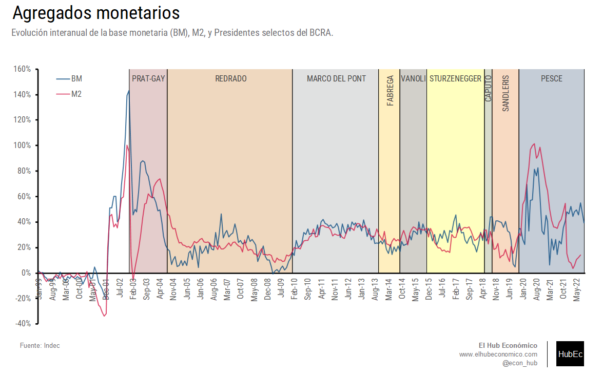
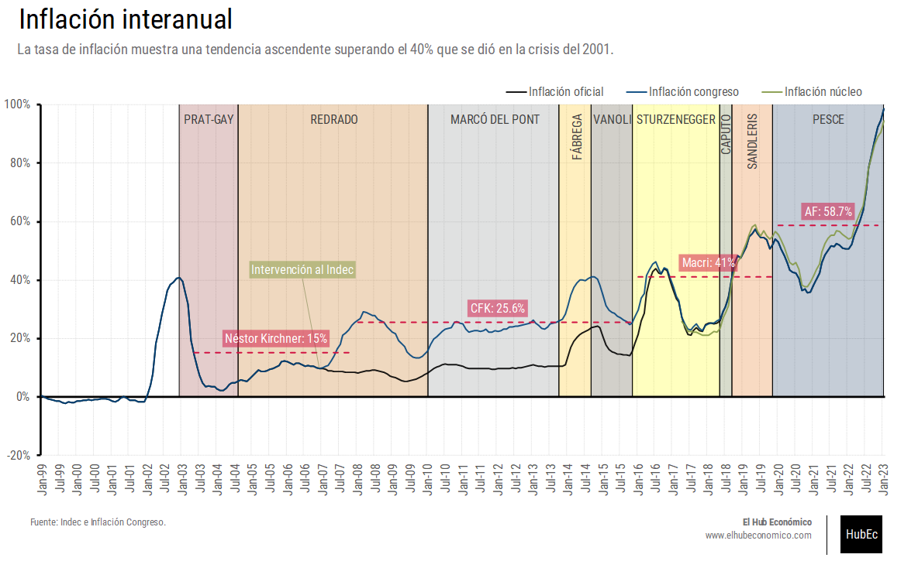
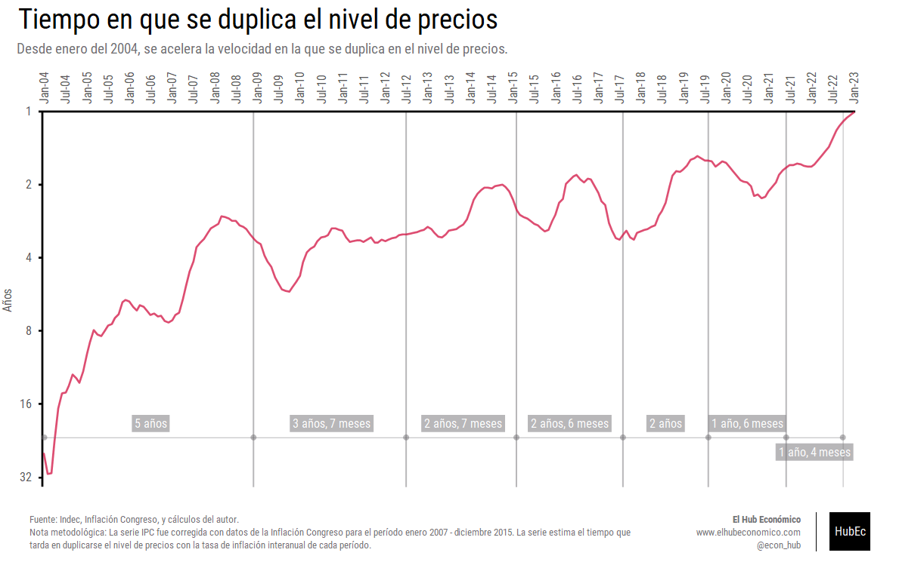
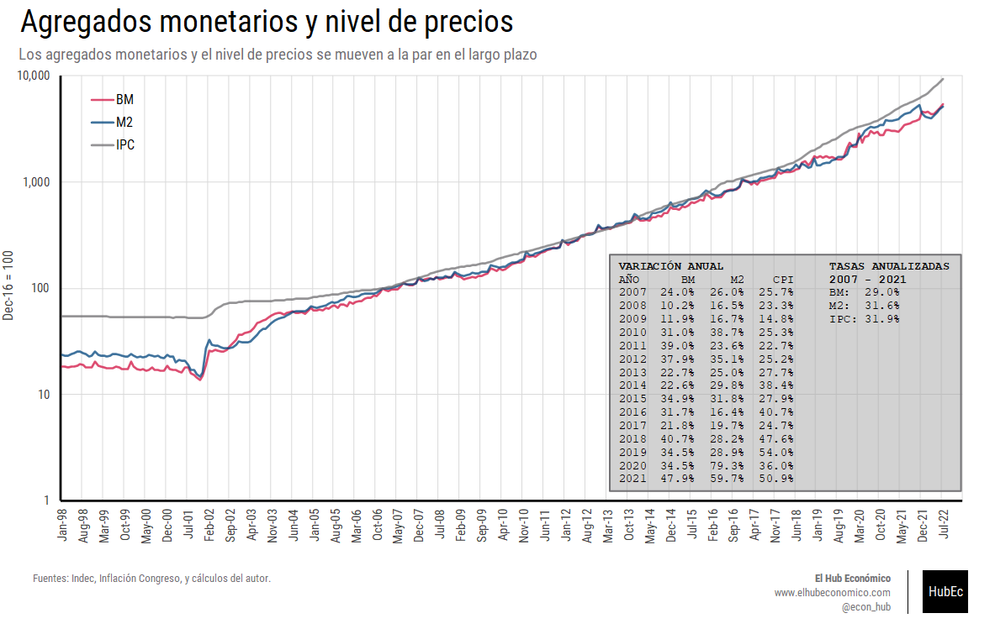
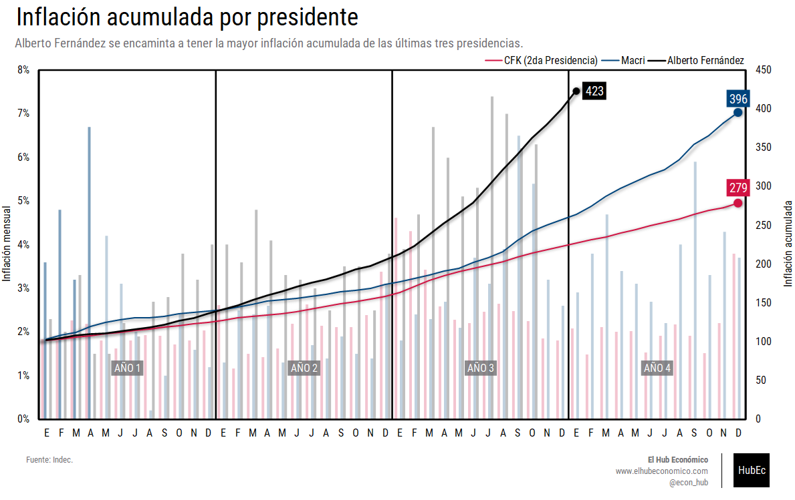
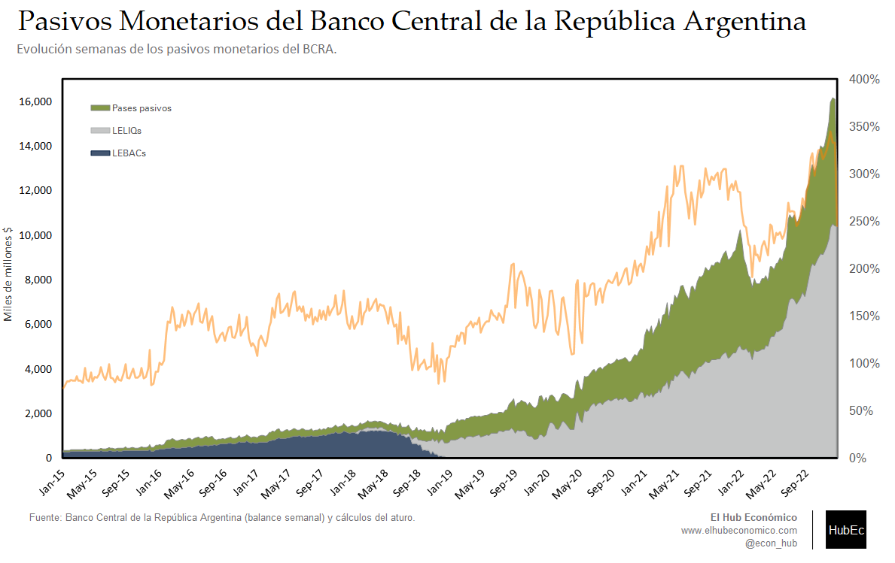

---
# Title, summary, and page position.
linktitle: "Agregados monetarios y precios"
weight: 2

# Page metadata.
title: Agregados monetarios y precios
type: book  # Do not modify.
---

---

## Gráfico 1. Agregados monetarios: Variación interanual

 [Download](02.01_Agregados_Monetarios.png)

---

## Gráfico 2. Inflación interanual

 [Download](02.02_Inflacion_Interanual.png)

---

## Gráfico 3. Tiempo en que se duplica el nivel de precios

 [Download](02.03_Precios_x2.png)

---

## Gráfico 4. Agregados monetarios e IPC

 [Download](02.04_Agregados_Monetarios_IPC.png)

---

## Gráfico 5. Inflación acumulada por presidente

 [Download](02.05_Inflacion_Acumulada.png)

---

## Gráfico 6. Reservas del BCRA

 [Download](02.06_Reservas_Semanal.png)

---

## Gráfico 7. Pasivos del BCRA

 [Download](02.07_Pasivos_Monetarios_BCRA.png)

---

## Grafico 8. Pérdida del poder adquisitivo de 100 pesos

 [Download](02.08_Evita.png)