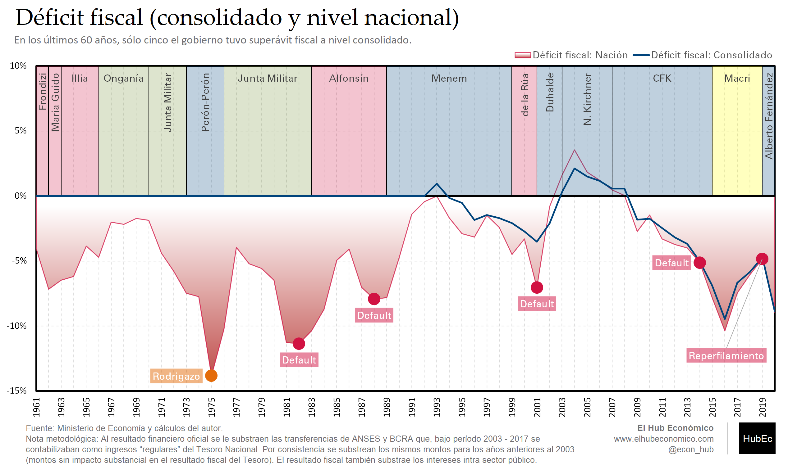
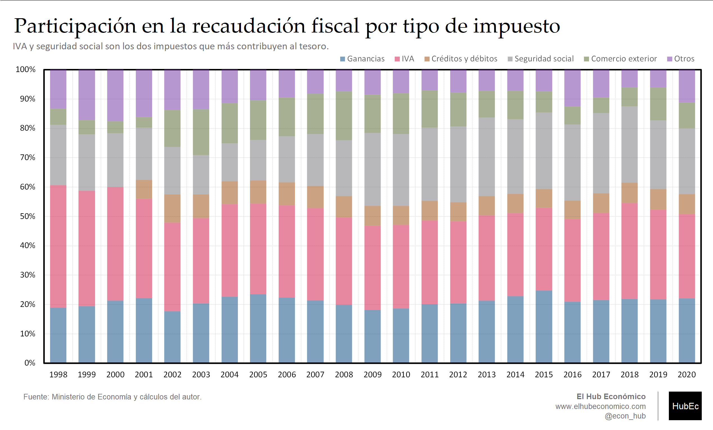
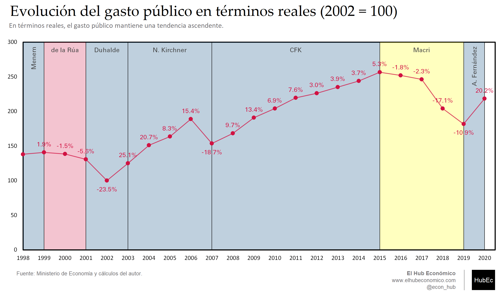
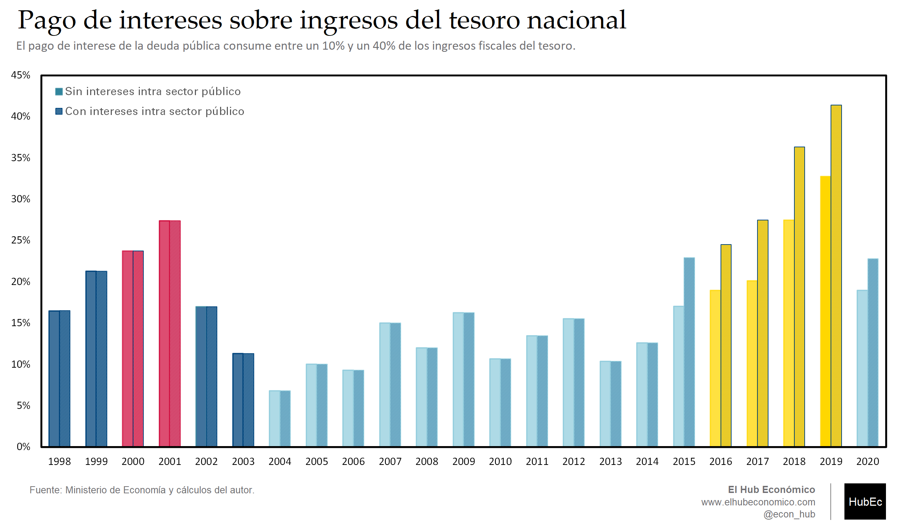
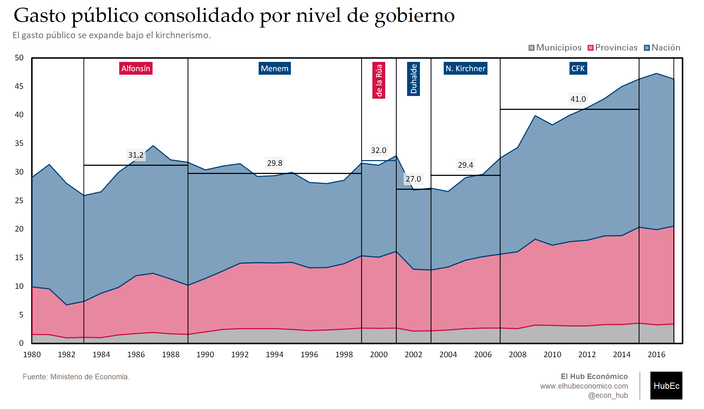
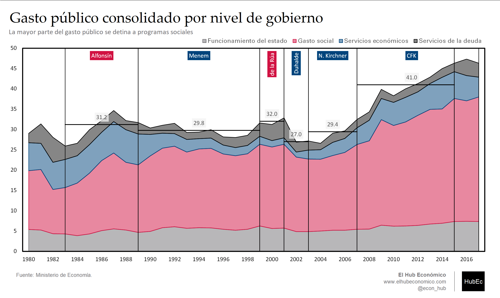
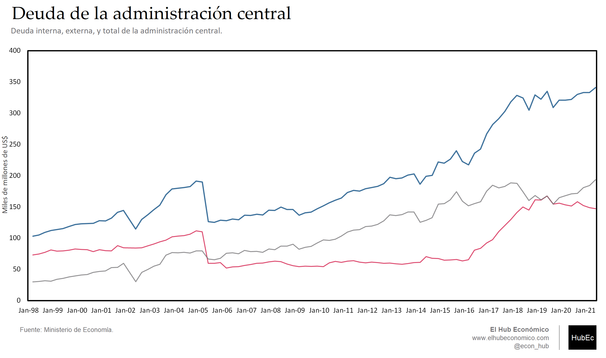
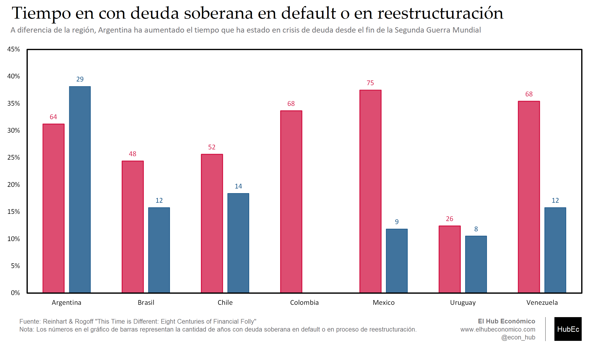

---
# Title, summary, and page position.
linktitle: "Datos fiscales"
weight: 3

# Page metadata.
title: Datos fiscales
type: book  # Do not modify.
---

---

## Gráfico 1. Déficiti fiscal (nación y consolidado)

 [Download](03.01_Deficit_Consolidado.png)

---

## Gráfico 2. Recaudación por impuesto

 [Download](03.02_Participacion_Impuesto.png)

---

## Gráfico 3. Gasto del tesoro nacional (pesos del 2002 | 2002 = 100)

 [Download](03.03_Gasto_Real.png)

---

## Gráfico 4. Intereses sobre ingresos del Tesoro National

 [Download](03.04_Intereses_Ingresos.png)

---

## Gráfico 5. Gasto consolidado por nivel de gobierno (1980 - 2017)

 [Download](03.05_Gasto_Consolidado_Nivel.png)

---

## Gráfico 6. Gasto consolidado por finalidad (1980 - 2017)

 [Download](03.06_Gasto_Consolidado_Finalidad.png)

---

## Gráfico 7. Deuda de la administración central

 [Download](03.07_Deuda_Publica.png)

---

## Gráfico 8. Tiempo en default o bajo reestructuración desde la independencia y la Segunda Guerra Mundial

 [Download](03.08_Tiempo_Default.png)