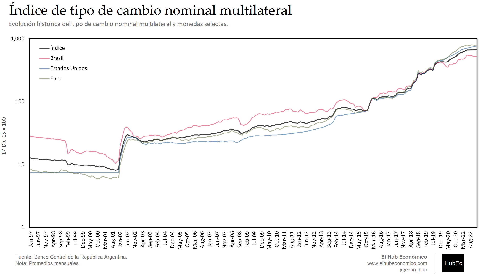
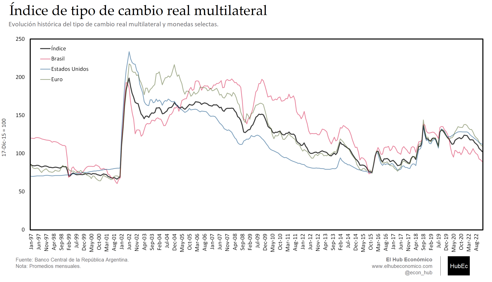
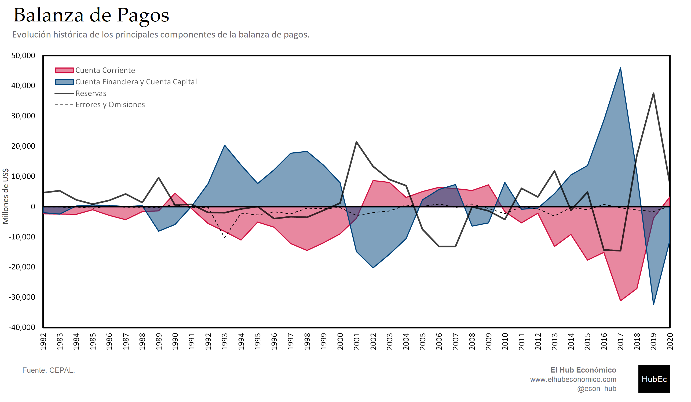
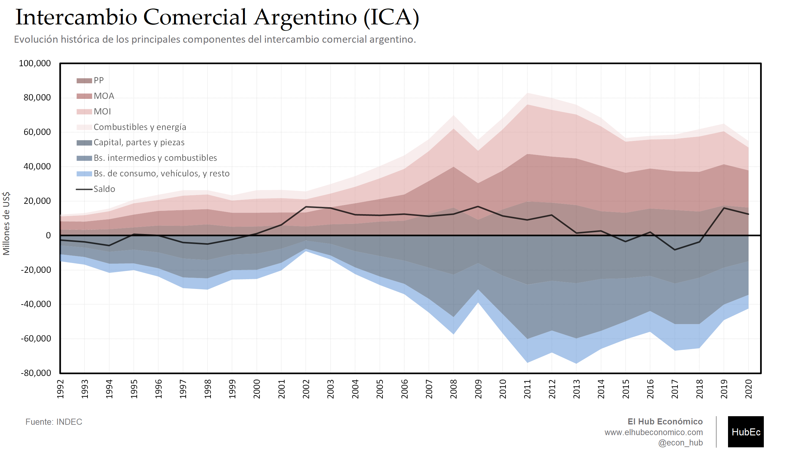
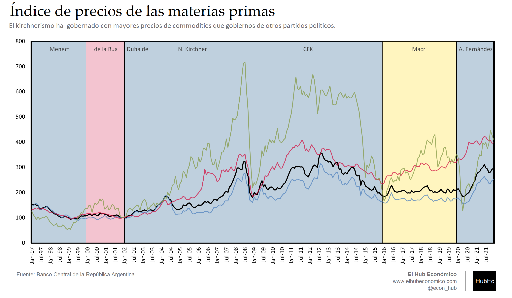

---
# Title, summary, and page position.
linktitle: "Comercio internacional"
weight: 5

# Page metadata.
title: Comercio internacional
type: book  # Do not modify.
---

---

## Gráfico 1. Índice de tipo de cambio nominal multilateral (17-Ene-12 = 100)

 [Download](05.01_ITCNM.png)

---

## Gráfico 2. Índice de tipo de cambio real multilateral (17-Ene-12 = 100)

 [Download](05.02_ITCRM.png)

---

## Gráfico 3. Balanza de Pagos

 [Download](05.03_BOP.png)

---

## Gráfico 4. Intercambio Comercial Argentino (ICA)

 [Download](05.04_ICA.png)

---

## Gráfico 5. Índice de Precios de las Materias Primas (IPMP)

 [Download](05.05_IPMP.png)
