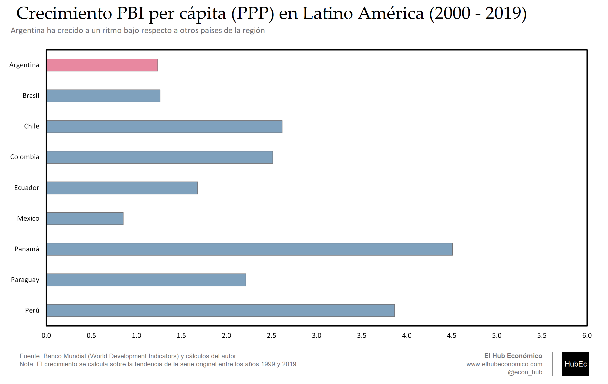
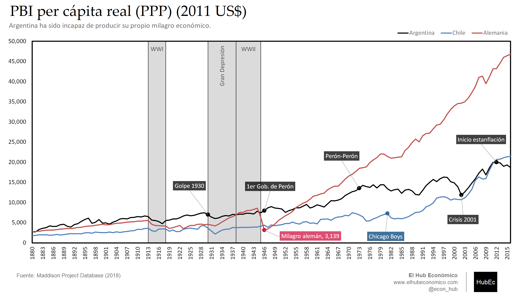
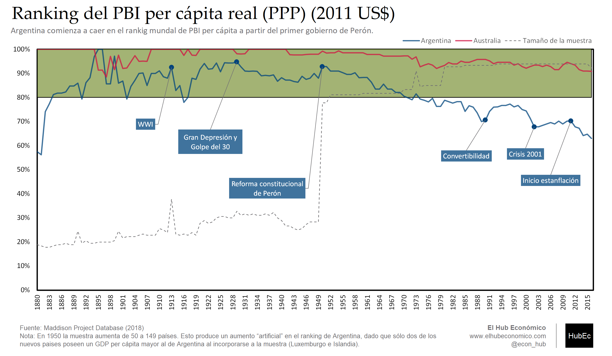
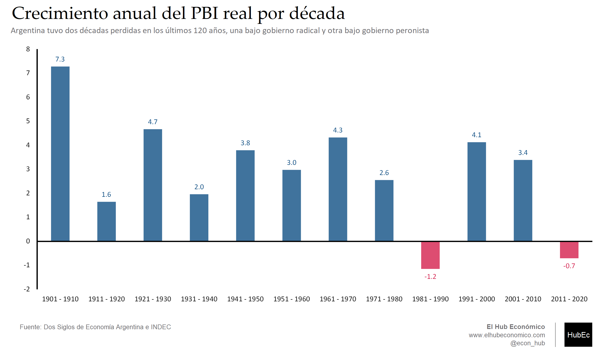

---
# Title, summary, and page position.
linktitle: "Desarrollo y series de largo plazo"
weight: 6

# Page metadata.
title: Desarrollo y series de largo plazo
type: book  # Do not modify.
---

---

## Gráfico 1. Crecimiento en Latino América: Tendencia (países selectos) (2000 - 2019)

 [Download](06.01_Crecimiento_2000.png)

---

## Gráfico 2. PBI per capita real PPP (2011 US$)

 [Download](06.02_GDP_Maddison.png)

---

## Gráfico 3. PBI per capita real PPP (2011 US$) (ranking mundial)

 [Download](06.03_PBI_Ranking.png)

---

## Gráfico 4. Crecimiento anualizado, PBI real, por décadas

 [Download](06.04_PBI_por_Decadas.png)